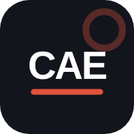

<div align="center">



# Ruta CAE

**Plataforma de estudio para el Cambridge C1 Advanced (CAE).**
Ruta C2 + los servicios de aprendizaje de FlexiLingo Desk, reconstruidos solo para el CAE.

Web (PWA instalable) · App de escritorio (Windows / macOS / Linux) · Extensión de Chrome para YouTube

</div>

---

## Qué es

Ruta CAE junta dos cosas:

1. **Ruta C2**: el motor de práctica del CAE (Use of English Parts 1–4, Reading 5–8, Listening 1–4, Writing y Speaking con nota por criterios Cambridge, diagnóstico automático de errores, repetición espaciada, plan diario, hoja de respuestas para tests externos, importación de tus libros).
2. **FlexiLingo Desk** ([flexilingo/Flexi-Desk](https://github.com/flexilingo/Flexi-Desk), AGPL-3.0): sus servicios de aprendizaje (reproductor de vídeo/podcast con transcript y niveles CEFR, guardar palabras con un clic, tutor de conversación por voz, Deck Hub, exportar a Anki, extensión de navegador) adaptados al CAE.

Todo lo que no servía para el CAE se quitó: los otros 9 idiomas (es, fr, de, zh, ar, fa, tr, hi, ru), la traducción a lengua materna, la sincronización con la nube de FlexiLingo (Supabase), el directorio de PodcastIndex, los plugins y el “escape room”.

## Módulos

| Módulo | Viene de | Qué hace para el CAE |
| :-- | :-- | :-- |
| Today · plan diario | Ruta C2 | Rutina diaria, racha, “STUDY NOW” que ataca tu tema más débil |
| Practice | Ruta C2 | UoE 1–4 y Reading con diagnóstico de cada error, preguntas nuevas con IA |
| Listening | Ruta C2 | Partes 1–4 con audio dos veces, evidencia y transcript (con tu paquete privado) |
| **Media Lab** | FlexiLingo (Podcast Player) | YouTube / podcast / audio / artículo → nivel CEFR (B2 · C1 · C2), velocidad, palabras C1–C2 coloreadas y clicables, preguntas tipo Listening Part 2/3 o Reading Part 5, “study brief” |
| Writing & Speaking | Ruta C2 | Corrección tipo Write & Improve, Band 1–5 por criterio y *Upgraded C1 Version* |
| **Speaking Tutor** | FlexiLingo (AI Tutor) | Conversación por voz: simulación de examen (Partes 1–4), conversación libre, role-play, deck practice, reto de paráfrasis; nota por GR / LR / DM / IC |
| Vocabulary | Ruta C2 + FlexiLingo | Listas por tema, flashcards SRS, **Captured words** (lo que guardas en vídeos, tutor y webs), **Deck Hub** (texto o foto → mazo), **exportar a Anki** |
| **Weekly Word Sheet (PDF)** | nuevo | Todas las palabras marcadas en la semana: significado, nivel, collocation, la frase donde la viste, espacio para tu frase, gap-fill con tus frases y la clave. Se imprime/guarda como PDF |
| Learn · Resources · Progress | Ruta C2 | Teoría, banco de recursos con hoja de respuestas, nota estimada por paper |
| **Extensión de Chrome** | FlexiLingo (extensión) | En YouTube: nivel del vídeo para el CAE, palabras difíciles, subtítulos con palabras C1–C2 coloreadas y clicables, guardar palabras, “Send to Ruta CAE”; en cualquier web: seleccionar → clic derecho → guardar |
| **App de escritorio** | FlexiLingo Desk (Tauri) | Ventana nativa offline con la misma app |

## Empezar en 2 minutos

```bash
git clone https://github.com/<tu-usuario>/ruta-cae
cd ruta-cae
npm run dev          # abre http://localhost:8080
```

No hay build: `app/` es HTML + JS puro. Cualquier servidor estático vale.

### 1 · Conectar la IA (⚙ Settings → AI)

La corrección, los diagnósticos, el tutor y las preguntas necesitan un modelo. Tu clave se guarda solo en tu navegador.

- **Claude (Anthropic)**: la mejor calidad de corrección. Crea una API key en console.anthropic.com.
- **Ollama**: gratis y offline. `ollama pull llama3.1` y arráncalo con `OLLAMA_ORIGINS=*`.
- **OpenRouter / Gemini / OpenAI** o cualquier endpoint compatible con OpenAI.

### 2 · Traer tu progreso y tus libros (⚙ Settings → Content pack)

El material con copyright (audio y transcripts del *Advanced Trainer*, tus libros) **no va en la repo pública**. Va en un *content pack* privado:

```bash
# pon tus archivos en private-pack/src/ (ver docs/CONTENT-PACK.md)
npm run pack         # → private-pack/ruta-cae-pack.zip
```

Luego en la app: ⚙ Settings → Content pack → Import. `private-pack/` está en `.gitignore`.

### 3 · Copias de seguridad (⚙ Settings → Backup & sync)

Todo vive en tu dispositivo (localStorage + IndexedDB). Exporta un `.json` para pasar tu progreso entre navegador, escritorio y móvil; importar **fusiona**, nunca borra.

## Publicar (deploy)

**Web (GitHub Pages)** — automático:

1. Sube la repo a GitHub.
2. Settings → Pages → Source: **GitHub Actions**.
3. Cada push a `main` publica `app/` en `https://<tu-usuario>.github.io/ruta-cae/`.

En el móvil: abre esa dirección → “Añadir a pantalla de inicio”.

**Escritorio + extensión (GitHub Releases)** — automático:

```bash
git tag v1.0.0 && git push --tags
```

El workflow `release.yml` compila los instaladores (`.msi`/`.exe`, `.dmg`, `.AppImage`/`.deb`) y `ruta-cae-extension.zip`, y los deja en un Release borrador para que lo publiques.

Para compilar el escritorio en local: [requisitos de Tauri](https://tauri.app/start/prerequisites/) y `npm install && npm run desktop:build`.

## Instalar la extensión

1. Descarga `ruta-cae-extension.zip` del último Release (o usa la carpeta `extension/`).
2. Chrome/Edge/Brave → `chrome://extensions` → *Developer mode* → *Load unpacked* → elige la carpeta.
3. Abre tu Ruta CAE una vez: la extensión aprende su dirección y desde entonces le pasa las palabras y vídeos guardados cada vez que la app está abierta.

> **Nota honesta sobre YouTube**: YouTube protege los subtítulos con un token, así que la extensión lee los subtítulos que descarga el propio reproductor (si hace falta, enciende los CC en inglés un momento). Por eso el nivel aparece al abrir un vídeo; las insignias en las miniaturas salen de los vídeos ya valorados y de los que YouTube deja leer en segundo plano.

## Cómo se calcula el nivel CEFR

Igual que FlexiLingo Desk (`nlp.rs`): cada palabra recibe un nivel según su frecuencia (Zipf de [wordfreq](https://github.com/rspeer/wordfreq)), con lematización ligera; se ignoran nombres propios y muletillas. El nivel del texto combina el % de palabras B2+/C1+/C2 y, en audio, la velocidad (palabras por minuto), con escalas separadas para habla y escritura. Calibrado con grabaciones reales del CAE (salen C1). **Es una estimación para elegir material, no una nota de Cambridge.**

## Estructura

```
app/                 la plataforma (web, PWA y escritorio usan esta misma carpeta)
  runtime.js         sustituye el runtime de claude.ai: IA propia, IndexedDB, archivos, carga de scripts
  core/              Ruta C2 (motor de examen, vistas, marcado, plan)
  flexi/             módulos estilo FlexiLingo: cefr, media, tutor, words (captured + PDF), deckhub, bridge, shell
  content/           banco de preguntas, teoría, léxico, tareas, vocabulario, recursos (sin material con copyright)
  data/cefr-words.js palabra → nivel CEFR
extension/           extensión Chrome MV3 (YouTube + guardar palabras en cualquier web)
desktop/src-tauri/   envoltorio Tauri 2 para Windows / macOS / Linux
tools/               build-pack (paquete privado), sync-extension, build-cefr-data
.github/workflows/   CI, deploy a Pages, release de escritorio + extensión
```

## Licencia y créditos

- Código bajo **AGPL-3.0-or-later** (la misma licencia que FlexiLingo Desk, del que se adaptan ideas, el método CEFR por frecuencia, los modos del tutor y la estructura de la extensión). Ver `LICENSE` y `NOTICE.md`.
- Datos de frecuencia: wordfreq (CC BY-SA 4.0). Diccionario: dictionaryapi.dev. Zip: JSZip (MIT). Transcripción en el navegador: Whisper vía transformers.js (Apache-2.0).
- No afiliado con Cambridge University Press & Assessment ni con FlexiLingo.
